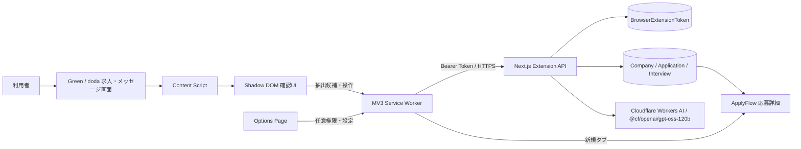
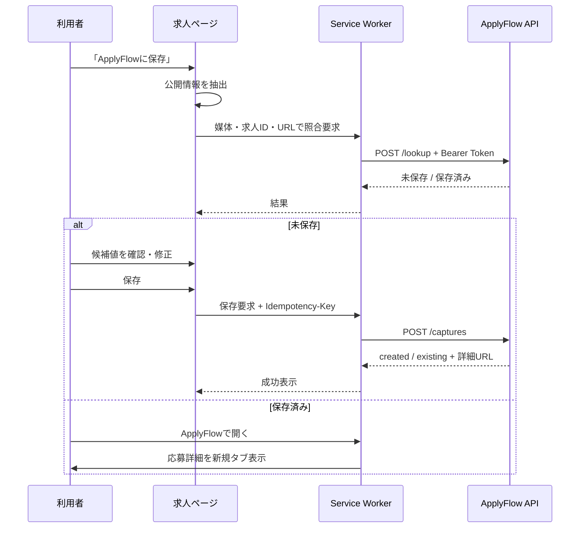

# ApplyFlow ブラウザ拡張機能設計書 v2.5

更新日: 2026-07-15  
対象実装: ApplyFlow v0.1.0 / Chrome拡張 v0.2.0 / Manifest V3  
ステータス: MVP実装済み

## 1. 目的

本拡張機能は、本人がGreenまたはdodaを閲覧しているとき、求人詳細から応募先を保存し、企業メッセージの選択範囲から面接日時・候補日時・日時変更・取消を抽出して、本人の確認後に既存応募先へ反映する。

ApplyFlow本体の目的である「応募先、選考フェーズ、面談候補、返信待ち、期限の一元管理」への入口を短縮する機能であり、求人情報の収集・再配布や応募操作の自動化は目的としない。

## 2. 前提とスコープ

### 2.1 利用前提

- 利用者は本人1名である。
- Chrome Web Storeでは配布せず、ソースからビルドして開発者モードで読み込む。
- ApplyFlowはローカル環境、または本人管理下のHTTPS環境で稼働する。
- Green、dodaおよび各運営会社とは無関係の非公式ツールである。
- ソースコードは公開可能だが、トークン、実求人データ、Cookie、DBダンプは公開しない。

### 2.2 MVPで実装すること

- Green・doda求人詳細ページの判定
- 媒体単位の任意ホスト権限と有効・無効設定
- ページ右下の「ApplyFlowに保存」ボタン
- JSON-LD、可視DOM、公開メタデータ、URLからの候補抽出
- Shadow DOM内の確認・編集ドロワー
- 保存済み照合、新規保存、ApplyFlow詳細画面への遷移
- トークン発行・失効、ローカル設定削除
- URL正規化、重複防止、Idempotency-Key
- 合成DOMを使ったアダプターテスト
- 両媒体の非求人ページに表示する「面接日時を抽出」ボタン
- ユーザーが選択・貼付したメッセージ本文だけを対象とするAI抽出
- 応募先・対象面接・抽出日時・処理種別の登録前確認
- 確定日時、候補日時、日時変更、取消の既存Applicationへの反映
- 生本文を保存しないmessage digestベースの重複防止
- 抽出した会社名・ポジションによる応募先の自動照合と新規作成
- 完全一致した応募先への自動統合、表記ゆれ候補の確認

### 2.3 実装しないこと

- 求人一覧の一括取得、バックグラウンド巡回、定期監視
- 自動応募、応募ボタン監視、媒体への書き戻し
- 媒体Cookie、Local Storage、認証情報、内部APIレスポンスの取得
- `webRequest`による通信傍受
- 求人本文全文、企業メッセージ生本文、画像、ロゴ、添付ファイルの保存
- メッセージ画面の自動監視、未選択本文の自動送信、確認なしの面接登録
- 外部テレメトリー、クラッシュレポート送信
- Chrome Web Store配布、複数ユーザー向け運用、課金
- オフラインキューと自動再送

API障害時は入力を自動保存しない。ユーザーが画面を開いたまま再度保存する。誤送信や端末内への求人データ残留を避けるため、MVPでは永続キューを持たない。

## 3. 既存ApplyFlowとの整合

本拡張機能は、既存のNext.js 15 App Router、Auth.js、Prisma、PostgreSQL構成へ追加されている。Web画面の更新は引き続きServer Actionを使用するが、拡張機能はブラウザー外部コンテキストから呼び出すため、専用Route Handlerを使用する。

保存先は新しい「求人」集約ではなく、既存の`Company`と`Application`である。

| ApplyFlow項目 | 拡張機能からの値 |
|---|---|
| `Company.name` | 確認済み会社名 |
| `Application.position` | 確認済みポジション |
| `applicationType` | 拡張機能設定の既定値。保存前に変更可能 |
| `route` | `JOB_BOARD`固定 |
| `status` | `DRAFT`固定 |
| `priority` | `MEDIUM`固定 |
| `sourceUrl` | 正規化済み求人URL |
| `sourceSite` | `GREEN`または`DODA` |
| `sourceJobId` | 公開URLから取得できた場合のみ |
| `locationText` | 原文の勤務地候補 |
| `employmentTypeText` | 原文の雇用形態候補 |
| `compensationText` | 原文の給与・報酬候補 |
| `note` | ユーザー入力 |
| `capturedAt` | 抽出時刻 |
| `captureAdapterVersion` | 抽出アダプターバージョン |

企業メッセージの確認登録は、既存の`SelectionStage`、`Interview`、`ProposedSlot`へ書き込む。確定日時は`InterviewStatus.CONFIRMED`、候補日時は`WAITING_REPLY`と`ProposedSlotStatus.PENDING`になり、既存のダッシュボード・応募先詳細・カレンダー表示へ追加実装なしで反映される。取消時は対象Interviewの確定日時を消去し、未完了候補を`CANCELLED`へ更新する。Application自体を終了状態にはしない。

旧設計の「検討中」は現行`ApplicationStatus`に存在しないため使用しない。未応募の候補は`DRAFT`として登録し、既存画面から編集する。

## 4. 設計判断

| 論点 | 採用 | 理由 |
|---|---|---|
| 認証 | 専用Bearer Token | 既存Auth.jsのDBセッションCookieを拡張機能へ流用せず、個別に失効できる |
| Token受け渡し | Web設定画面で発行し、拡張設定へ1回貼付 | OAuth認可サーバーを新設せず、本人1名のローカル利用に必要十分 |
| Token保存 | サーバーはSHA-256 digest、Chromeは`storage.local` | DB漏えい時に平文Tokenを残さず、再表示しない |
| Content ScriptからのToken参照 | 禁止 | `storage.local.setAccessLevel(TRUSTED_CONTEXTS)`でService Workerと拡張ページに限定 |
| UI | TypeScript + DOM + Shadow DOM | React/Viteを追加せず、既存TypeScriptだけで小さいMV3成果物を作る |
| 権限 | `optional_host_permissions` + 動的登録 | 有効にした媒体とApplyFlow originだけを実行時に許可する |
| 保存済み照合 | 保存ボタン押下後 | ページを開いただけで閲覧情報を送信しない |
| 重複単位 | `userId + sourceKey`、正規化`sourceUrl` | 媒体求人ID、なければ正規化URLをSHA-256で安定キー化し、Web画面から同じURLを登録済みの場合も検出する |
| 冪等単位 | `userId + captureIdempotencyKey` | 二重クリックや同一リクエスト再送で新規作成しない |
| メッセージ取得 | 選択範囲またはユーザー貼付だけ | DOMセレクター変更と不要な個人情報送信を避ける |
| AI送信 | 抽出ボタン押下前に個別同意 | 選択本文がCloudflare Workers AI上の`@cf/openai/gpt-oss-120b`へ送信されることを明示する |
| AI結果 | 応募先・対象面接・日時を確認後に登録 | 誤抽出や誤紐付けを自動反映しない |
| 本文保持 | DB・ActivityLogへ保存しない | 登録重複防止には`sourceSite + trim済み本文`のSHA-256だけを使う |
| 日時変更 | 進行中の対象面接があれば必須選択して現在日時を置換。対象がなければ`CREATE_OR_UPDATE`へ補正 | 選べないリストを必須にせず、初回取り込み時も最新日時を登録できる |
| 取消 | 進行中の対象面接がある場合だけ選択可能にして予定・候補を取消 | 対象なしの取消やApplication全体の誤終了を防ぐ |
| 終了時刻欠損 | 60分をAI抽出の初期値とし編集可能 | ダッシュボード表示に必要な時間範囲を確保する |
| 応募先完全一致 | 正規化した会社名とポジションが一致した場合だけ自動統合 | 既存応募先を選ぶ二度手間をなくしつつ誤統合を防ぐ |
| 会社名表記ゆれ | 法人格を除いた名称が一致した場合は候補表示し、統合先を未選択のまま確認要求 | `株式会社〇〇`と`〇〇株式会社`を勝手に同一視しない |
| 既存企業・別ポジション | Companyだけ再利用してApplicationを新規作成 | 異なる求人ポジションを同じApplicationへ混在させない |
| 一致なし | 抽出した会社名・ポジションを編集可能にして、その場でCompany / Applicationを作成 | 求人保存画面へ戻る二度手間をなくす |

## 5. 全体構成



### 5.1 責務

| コンポーネント | 責務 |
|---|---|
| `extraction.ts` | 媒体判定、JSON-LD/可視DOM抽出、URL正規化 |
| `content.ts` | ボタン、確認ドロワー、編集、キーボード操作、メッセージ送信 |
| `background.ts` | Token隔離、権限に応じたContent Script登録、送信元検証、API通信 |
| `options.ts` | ApplyFlow URL、Token、応募種別、媒体権限、ローカル削除 |
| `popup.ts` | 設定画面への入口 |
| Extension API | Token認証、入力検証、重複判定、トランザクション保存 |
| ApplyFlow設定画面 | Token発行、最終利用確認、失効 |

## 6. ディレクトリ構成

```text
browser-extension/
├─ public/
│  ├─ manifest.json
│  ├─ options.html / options.css
│  └─ popup.html / popup.css
├─ scripts/build.mjs
├─ src/
│  ├─ background.ts
│  ├─ content.ts
│  ├─ extraction.ts
│  ├─ options.ts
│  ├─ popup.ts
│  └─ types.d.ts
├─ tsconfig.json
└─ README.md

app/api/browser-extension/
├─ lookup/route.ts
├─ captures/route.ts
├─ message-extractions/route.ts
└─ message-events/route.ts

features/browser-extension/
├─ actions.ts / queries.ts
├─ api.ts / auth.ts / contracts.ts / token.ts
├─ message-extraction.ts / message-registration.ts
└─ components/browser-extension-settings.tsx
```

`npm run extension:build`は、出力先を消去し、専用`tsconfig.json`でTypeScriptをコンパイルして、静的アセットを`browser-extension/dist`へコピーする。`npm run build`にも拡張機能ビルドを含める。

## 7. 権限設計

### 7.1 必須権限

| 権限 | 用途 |
|---|---|
| `storage` | 接続設定とTokenの端末内保存 |
| `scripting` | 許可済み媒体だけにContent Scriptを動的登録 |
| `activeTab` | ポップアップを開いた現在ページの判定と、明示操作による即時再挿入 |

### 7.2 任意ホスト権限

`manifest.json`は動的な自己ホスト先に対応するため、`https://*/*`、`http://localhost/*`、`http://127.0.0.1/*`を任意権限として宣言する。実際の要求は設定保存時に次の具体的originへ限定する。

- `https://*.green-japan.com/*`
- `https://*.doda.jp/*`
- 入力されたApplyFlowのorigin

外部ApplyFlowはHTTPSのみ許可し、HTTPは`localhost`と`127.0.0.1`だけ許可する。`cookies`、`history`、`tabs`、`webRequest`権限は要求しない。`activeTab`はユーザーが拡張アイコンを開いた現在タブにだけ一時アクセスする。

Chrome公式仕様に従い、`chrome.permissions.request()`は設定保存というユーザージェスチャー内で実行する。許可済み媒体だけ`chrome.scripting.registerContentScripts()`で永続登録する。最低Chromeバージョンは、Storage access levelを利用できる102とする。

ポップアップは現在URLが対応求人か、媒体権限があるかを診断する。「この求人ページで有効化」または「現在ページへボタンを再挿入」の明示操作では、媒体権限を要求し、永続登録を同期した後、現在タブへ`extraction.js`と`content.js`を即時挿入する。媒体権限の保存はAPI Token未設定でも可能とし、ボタン表示とApplyFlow API接続を分離する。

## 8. ページ判定・抽出

### 8.1 対象URL

| 媒体 | 詳細ページ判定 | 求人ID |
|---|---|---|
| Green | `/company/{number}/job/{number}` | `/job/`直後の数値 |
| doda | pathに`JobSearchDetail`または`j_jid__...` | `j_jid__...`または`jid` query |

URL一致に加え、`JobPosting` JSON-LDまたは可視の求人タイトルが存在することを確認する。求人詳細は求人保存モード、それ以外のGreen・dodaページはメッセージ抽出モードにする。後者をURLパターン限定にしないことで、媒体側のメッセージURL変更に耐える。メッセージモードはページ本文を自動取得せず、ユーザーが選択または貼付した本文だけを処理する。MutationObserver、`popstate`、`hashchange`、URL変化監視でSPA遷移後に再判定し、同じroot IDのUIを重複挿入しない。

### 8.2 抽出優先順位

1. 公開`application/ld+json`内の`JobPosting`
2. 媒体アダプターの可視DOMセレクター
3. 公開Open Graph metadata（求人タイトルの低信頼フォールバック）
4. 公開URL
5. ユーザー入力

各候補は`value`、`confidence`（high / medium / low / missing）、`source`（json_ld / visible_dom / meta / url）を持つ。UIへは候補値と未取得警告を表示する。DOM変更時は空値を隠さず、必須の会社名・ポジションを手入力できる。

### 8.3 URL正規化

- fragmentを削除する。
- hostnameを小文字化する。
- `utm_*`、`gclid`、`fbclid`、`yclid`、`ref`、`referrer`を削除する。
- 残るqueryをsortする。
- root以外の末尾slashを削除する。
- canonical URLは現在ページと同じhostnameの場合だけ採用する。

拡張機能とサーバーの両方で正規化し、サーバー側を正本とする。通常のApplication作成・編集でも同じサーバー共通関数を適用する。

## 9. UI・操作フロー



ドロワーは`role=dialog`、`aria-modal=false`の非モーダルパネルとする。パネル外では媒体ページのクリック、スクロール、文字選択、Tab移動を妨げない。メッセージ画面の起動ボタンは媒体の送信欄を避けて下端から96px（狭幅では88px）離す。右上の「−」、「一時的に隠す」、またはEscapeで一時的に隠し、入力・抽出・確認状態を保持する。起動ボタンを「日時抽出を再開」へ変更し、再表示時は退避前の入力フォーカスへ戻す。デスクトップは右側パネル、スマートフォンは上側の媒体画面を残す最大72vhの下部パネルにする。媒体ページとのスタイル競合を避けるためclosed Shadow DOMへ描画する。

### 9.1 企業メッセージから面接登録

1. 利用者が企業から届いた1メッセージを選択し、「面接日時を抽出」を押す。選択しにくい場合はパネルを開いたまま媒体画面で選択し、「現在の選択を取り込む」を押すか、テキスト欄へ貼り付ける。
2. ドロワーは送信対象本文を表示し、Cloudflare Workers AI上の`@cf/openai/gpt-oss-120b`処理への同意を要求する。
3. APIは`CREATE_OR_UPDATE`、`RESCHEDULE`、`CANCEL`、選考種別、確定日時、候補日時、面接URL、担当者、confidenceをstrict JSON Schemaで抽出する。
4. 会社名・ポジションを正規化して本人所有のApplication / Companyと照合し、完全一致、表記ゆれ候補、一致なしを判定する。
5. 完全一致は既存応募先を初期選択する。表記ゆれ候補は未選択で止め、既存への統合または新規作成を利用者へ確認する。一致しない場合は抽出値から新規応募先を初期選択する。
6. 利用者が会社名、ポジション、登録方法、処理種別、対象面接、日時を確認・修正する。変更・取消は進行中の対象Interviewがある場合だけ選択可能にする。新規応募先または対象Interviewがない応募先では`CREATE_OR_UPDATE`へ自動補正し、対象欄を「対象面接なし（新規として登録）」として無効化する。
7. 確認済み構造化データだけをトランザクション登録し、必要ならCompany / Applicationも同時作成して、ダッシュボード・応募先・カレンダーへ反映する。

会社名の完全一致はNFKC、英字小文字化、空白・記号除去後の一致とする。表記ゆれ候補は、さらに`株式会社`、`有限会社`、`合同会社`、`Inc.`、`Corp.`、`Ltd.`などの法人格を除いた名称が一致する場合に限定する。編集距離による広い曖昧一致は誤統合を避けるため行わない。

選択本文はService WorkerとAPIメモリを経由してCloudflare Workers AI上の`@cf/openai/gpt-oss-120b`へ送るが、Cloudflareの保存サービス、PostgreSQL、Chrome storage、ActivityLog、サーバーログへ保存しない。AIのevidenceは確認レスポンスにだけ含まれ、登録APIへ送らない。

## 10. 認証・Tokenライフサイクル

1. ログイン済みユーザーがApplyFlowの設定画面でTokenを発行する。
2. サーバーは`af_ext_`から始まるランダム32-byte Tokenを一度だけ返す。
3. DBにはTokenのSHA-256 digestと表示用prefixだけを保存する。
4. ユーザーがTokenを拡張設定へ貼り付ける。
5. Service Workerが`Authorization: Bearer ...`を付ける。
6. APIはdigest一致、`revokedAt`、`expiresAt`を確認し、`lastUsedAt`を更新する。
7. ユーザーはApplyFlow設定画面から個別に失効する。

Content ScriptへTokenを返すメッセージは実装しない。`GET_SETTINGS`は既定応募種別と設定済みフラグだけを返す。ログアウトはWebセッションだけを終了するため、拡張Tokenは自動失効しない。端末紛失や利用終了時は設定画面から明示的に失効する。

## 11. API契約

共通:

- Method: `POST`
- Authentication: `Authorization: Bearer af_ext_...`
- Content-Type: `application/json`
- Body上限: 64 KiB。選択本文は12,000文字以下
- CORS: Bearer認証のためcredentialsを使用せず、`POST / OPTIONS`だけ許可
- Response: `Cache-Control: no-store`

### 11.1 保存済み照合

`POST /api/browser-extension/lookup`

```json
{
  "sourceSite": "GREEN",
  "sourceJobId": "345",
  "sourceUrl": "https://www.green-japan.com/company/12/job/345"
}
```

未保存時は`{ "ok": true, "saved": false }`、保存済み時はApplication ID、詳細URL、会社名、ポジション、ステータス、直近の未完了期限を返す。メモやメール本文は返さない。

### 11.2 新規保存

`POST /api/browser-extension/captures`

Headerに16〜100文字の`Idempotency-Key`を必須とする。bodyは以下を受け付ける。

```json
{
  "sourceSite": "GREEN",
  "sourceJobId": "345",
  "sourceUrl": "https://www.green-japan.com/company/12/job/345",
  "companyName": "Example Works",
  "position": "Frontend Engineer",
  "applicationType": "CAREER_CHANGE",
  "locationText": "東京都",
  "employmentTypeText": "正社員",
  "compensationText": "年収500万円〜700万円",
  "note": "確認用メモ",
  "capturedAt": "2026-07-15T12:00:00+09:00",
  "adapterVersion": "1.0.0"
}
```

サーバーはZod検証、媒体とURL hostの整合確認、正規化、sourceKey・Idempotency-Key・正規化sourceUrlによる重複確認を行う。同じユーザーに完全一致する会社名がある場合は既存Companyを再利用し、ApplicationとActivityLogをトランザクションで作成する。

レスポンスの`result`は`created`または`existing`である。競合する同時保存はDB unique制約の`P2002`を捕捉し、既存レコードを返す。

### 11.3 メッセージ日時抽出

`POST /api/browser-extension/message-extractions`

bodyは媒体、現在URL、選択本文、ページタイトル、取得時刻、`consentToAiProcessing: true`を受け付ける。サーバーはToken所有者のtimezoneを使い、Cloudflare Workers AI REST APIへstrict JSON Schemaを要求し、返却JSONをZodで再検証して次を返す。Schema不一致時は登録しない。

- `eventType`: `CREATE_OR_UPDATE` / `RESCHEDULE` / `CANCEL`
- 会社名、ポジション、選考種別、選考名
- 確定日時、最大10件の候補日時、面接URL、担当者
- confidence、項目別confidence、短いevidence
- Application候補と、そのApplicationに属する既存Interview
- 完全一致Application、表記ゆれApplication、完全一致Company、表記ゆれCompany
- 推奨Application / Interview IDと、確認が必要な照合種別
- 生本文の代わりに使用するSHA-256 `messageDigest`

### 11.4 面接イベント確認登録

`POST /api/browser-extension/message-events`

Headerに`Idempotency-Key`を必須とし、任意の確認済みApplication ID / Company ID、会社名、ポジション、応募種別、対象Interview ID、event type、日時、選考種別、`messageDigest`を受け付ける。サーバーはApplication、Company、InterviewがToken所有者のものか再検証する。

- 新規: SelectionStageを再利用または追加し、Interviewと日時を作成する。
- 応募先未登録: 完全一致Companyを再利用し、同一ポジションのApplicationがあれば統合、なければCompany / Applicationを作成してから面接を登録する。
- 更新: 選択したInterviewへ確定・候補日時を登録する。
- 日時変更: 選択したInterviewの未完了日時を`CANCELLED`にして新日時へ置換する。
- 取消: Interviewを`CANCELLED`にし、確定日時を消去して未完了候補も取消する。
- 重複: `(userId, idempotencyKey)`または`(userId, applicationId, messageDigest)`が一致した既存結果を返す。

## 12. DB設計

### 12.1 Application追加項目

| 項目 | 型 | 用途 |
|---|---|---|
| `sourceSite` | String? | 媒体 |
| `sourceJobId` | String? | 公開求人ID |
| `sourceKey` | String? | 重複判定digest |
| `locationText` | String? | 勤務地原文 |
| `employmentTypeText` | String? | 雇用形態原文 |
| `compensationText` | String? | 給与・報酬原文 |
| `capturedAt` | DateTime? | 抽出時刻 |
| `captureAdapterVersion` | String? | アダプターバージョン |
| `captureIdempotencyKey` | String? | API要求識別子 |

unique制約は`(userId, sourceKey)`と`(userId, captureIdempotencyKey)`である。Applicationを論理削除すると両キーをnullにし、同じ求人を後から再登録できるようにする。

### 12.2 BrowserExtensionToken

| 項目 | 用途 |
|---|---|
| `userId` | Token所有者 |
| `name` | Token名。MVPはChrome extension固定 |
| `tokenHash` | SHA-256 digest、unique |
| `tokenPrefix` | 設定画面の識別表示 |
| `lastUsedAt` | 最終API認証時刻 |
| `expiresAt` | 任意の有効期限。MVP発行時はnull |
| `revokedAt` | 失効時刻 |

### 12.3 BrowserMessageImport

| 項目 | 用途 |
|---|---|
| `userId` / `applicationId` / `interviewId` | 所有者と反映先 |
| `sourceSite` | `GREEN`または`DODA` |
| `eventType` | 新規・更新、日時変更、取消 |
| `messageDigest` | trim済み選択本文のSHA-256。本文自体は保持しない |
| `idempotencyKey` | 二重クリック・再送防止 |
| `createdAt` | 確認登録時刻 |

unique制約は`(userId, idempotencyKey)`と`(userId, applicationId, messageDigest)`である。

## 13. セキュリティ境界

- APIはWebセッションCookieを受け付けず、専用Bearer Tokenだけで認証する。
- Service WorkerはContent Scriptの送信元URLとpayloadの媒体hostを再検証する。
- 「ApplyFlowで開く」は設定済みApplyFlow originかつ`/applications/`配下だけを許可する。
- サーバーはクライアントの正規化値や重複キーを信用せず再計算する。
- ユーザー所有データは必ず認証Tokenの`userId`で絞り込む。
- HTML文字列を求人値から組み立てず、フォームの`.value`または`textContent`へ設定する。
- 外部環境への平文HTTPを拒否する。
- CSPは`script-src 'self'; object-src 'none'`とし、remote codeを使用しない。
- ログにToken、求人本文、Cookieを出力しない。
- メッセージ本文は明示同意後の抽出要求にだけ含め、永続化・ログ出力しない。
- 登録APIはAI推奨IDを信用せず、ApplicationとInterviewの所有関係を再検証する。
- 日時変更・取消は対象Interviewを必須にし、Application全体のステータスを終了へ変更しない。

## 14. エラー処理

| code / 状態 | UI挙動 |
|---|---|
| `AUTH_REQUIRED` / 401 | Token設定を案内し、設定ボタンを表示 |
| `INVALID_INPUT` / 400 | 入力確認を案内 |
| `INVALID_IDEMPOTENCY_KEY` / 400 | 保存要求エラー |
| `UNTRUSTED_SENDER` | 保存せず、許可外ページとして扱う |
| `NETWORK_ERROR` | 入力を画面に残し、再操作可能にする |
| `SERVER_ERROR` / 500 | 求人ページは妨げず、ドロワー内だけに表示 |
| 権限拒否 | 設定を保存せず、許可が必要なことを表示 |
| 抽出欠損 | 未取得警告を表示し、会社名・ポジションを手入力 |
| `EXTRACTION_FAILED` / 422 | 本文を画面に残し、再抽出できる |
| `INVALID_TARGET` / 400 | 応募先または対象面接の再選択を求める |
| `DUPLICATE_MESSAGE` / 409 | 登録済みとして扱い、重複作成しない |

## 15. テスト設計と品質ゲート

### 15.1 自動テスト

- Green JSON-LD抽出とtracking parameter除去
- doda可視DOMフォールバック
- Green一覧ページの除外
- URL正規化とsourceKey安定性
- 媒体・host不一致の拒否
- capture payload schema
- Token形式とdigest
- 既存Application schema、メール取込、Calendar、衝突検知の回帰
- メッセージ抽出のstrict schema、明示同意、日時timezone、変更・取消分類
- 確定・候補・取消の状態遷移
- 対象Interview必須、message digest安定性、生本文非保持
- Green非求人ページのメッセージモード起動

合成した架空DOMだけをテストへコミットし、実求人ページHTMLは使用しない。

### 15.2 完了条件

```bash
npm test
npm run typecheck
npm run lint
npm run build
```

上記に加え、Chromeへ`browser-extension/dist`を読み込めること、設定で媒体権限を付与・解除できること、実ページで抽出候補を人が確認できることを手動スモークテストする。

## 16. 導入・運用

1. `npm install`、DB起動、環境変数設定を行う。
2. `npm run prisma:migrate`で`20260715120000_add_browser_extension`と`20260715140000_add_browser_message_import`を適用する。
3. `npm run extension:build`を実行する。
4. `chrome://extensions`のデベロッパーモードで`browser-extension/dist`を読み込む。
5. ApplyFlowへGoogleログインし、`/settings`で拡張Tokenを発行する。
6. 対象媒体ページで拡張アイコンを開き、「このページで有効化」を押してChromeの権限を許可する。
7. 保存機能を使う場合は、拡張機能の詳細設定へApplyFlow URLとTokenを入力する。
8. ボタンが見つからない場合はポップアップの診断結果を確認し、「現在ページへボタンを再挿入」を押す。

障害時は拡張設定で該当媒体を無効化する。Token漏えいが疑われる場合はApplyFlow設定画面ですぐ失効し、再発行する。

## 17. 受け入れ基準

- ページ表示だけではApplyFlowへ通信しない。
- Green・dodaの求人詳細には求人保存ボタン、それ以外の媒体ページには面接日時抽出ボタンを表示する。
- 会社名、ポジション、勤務地、雇用形態、給与・報酬、応募種別、メモを保存前に確認・編集できる。
- 必須抽出失敗時も手入力で保存できる。
- 同じ求人または同じIdempotency-KeyでApplicationを重複作成しない。
- 保存結果から本人のApplyFlow詳細を開ける。
- TokenがContent Script、求人DOM、サーバーDBの平文、ログへ露出しない。
- 媒体権限を個別に付与・解除できる。
- 求人本文、画像、Cookie、媒体認証情報を取得・送信しない。
- メッセージ本文は利用者の選択・明示同意時だけAIへ送り、DB・Chrome storage・ログへ保存しない。
- AI抽出結果を直接登録せず、応募先・対象面接・日時を確認できる。
- 確定日時と候補日時がダッシュボードと応募先へ反映される。
- 日時変更は選択した面接だけを置換し、取消は予定をダッシュボードから除外する。
- 同一メッセージを同じ応募先へ重複登録しない。
- 抽出した会社名・ポジションが完全一致する応募先は初期選択され、既存データへ統合される。
- 法人格位置などの表記ゆれ候補は自動統合されず、利用者が既存統合か新規作成を選択する。
- 一致する応募先がない場合、同じ確認パネル内でCompany / Applicationと面接を一度に作成できる。
- 拡張機能の失敗が媒体ページ本体の操作を妨げない。
- Test、Typecheck、Lint、Extension Build、Next production buildが成功する。

## 18. 既知の制約と残る確認

- 媒体DOMは変更され得る。JSON-LDを優先するが、可視DOM fallbackは実ページで継続確認する。
- リポジトリには実求人HTMLを置かないため、実媒体での最終スモークテストは自動化しない。
- doda/GreenのURL形式が追加された場合は、対象を広げる前に一覧ページ誤検知がないことをテストする。
- Chromeの権限画面で利用者が後からsite accessを変更した場合、設定保存または拡張再起動時に登録状態を再同期する。
- `lastUsedAt`はAPI呼び出しごとに更新するため、高頻度利用時は追加DB writeが発生する。個人利用MVPでは許容する。
- Tokenに既定有効期限はない。利用終了時の明示失効を運用条件とする。
- メッセージ画面のURL・DOMは媒体都合で変わるため、非求人ページ共通ボタンと選択範囲方式を採用している。媒体ページ内のどこでも表示される点は個人利用MVPの意図した挙動である。
- 実メッセージ本文をfixtureへ含めないため、媒体画面での選択操作とAI精度は利用者による最終スモークテストを要する。

## 19. 将来拡張

優先順位は、実利用で確認した課題に限定する。

1. 合成fixtureを増やし、媒体DOM変更の検知精度を上げる。
2. Tokenに有効期限とローテーション案内を追加する。
3. 対象媒体を追加するときは独立アダプターと任意権限を追加する。
4. 必要性が確認できた場合だけ、明示操作による一時保存・手動再送を検討する。

一般配布、第三者利用、Chrome Web Store公開へ変更する場合は、本設計をそのまま流用せず、OAuth認可、プライバシーポリシー、ストア審査、サポート、監視、利用規約を別途設計する。

## 20. 参考資料

- Chrome Extensions Manifest: https://developer.chrome.com/docs/extensions/reference/manifest
- Permissions API: https://developer.chrome.com/docs/extensions/reference/api/permissions
- Scripting API: https://developer.chrome.com/docs/extensions/reference/api/scripting
- Message passing: https://developer.chrome.com/docs/extensions/develop/concepts/messaging
- Extension service workers: https://developer.chrome.com/docs/extensions/develop/migrate/to-service-workers
- Cross-origin requests: https://developer.chrome.com/docs/extensions/develop/concepts/network-requests
- ApplyFlow仕様書: `docs/ApplyFlow_仕様書.md`
- ApplyFlowアーキテクチャ設計書: `docs/ApplyFlow_アーキテクチャ設計書.md`
- ApplyFlow DB設計書: `docs/ApplyFlow_DB設計書.md`

## 21. 変更履歴

| バージョン | 日付 | 内容 |
|---|---|---|
| 1.0〜1.2 | 2026-07-15 | 実装前の構想、個人利用・公開リポジトリ方針を整理 |
| 2.0 | 2026-07-15 | 現行ApplyFlowへ統合。専用Token API、Application拡張、任意権限、動的Content Script、実装済みUI・抽出・テスト・導入手順を正本化 |
| 2.1 | 2026-07-15 | Green・dodaの企業メッセージから、確認後に面接の確定・候補・変更・取消を既存応募先へ反映する設計と実装を追加 |
| 2.2 | 2026-07-15 | 抽出画面を非モーダルパネルへ変更し、媒体画面を操作したままメッセージを選択し直せるUXへ改善 |
| 2.3 | 2026-07-15 | メッセージから応募先も抽出し、完全一致の自動統合、表記ゆれ確認、未登録応募先の同時作成を追加 |
| 2.4 | 2026-07-15 | 変更・取消の対象となる進行中面接がない場合、選択不能な必須欄を出さず新規登録へ自動補正するUXを追加 |
| 2.5 | 2026-07-15 | メッセージ送信欄を避ける起動ボタン配置と、入力・抽出結果を保持したパネルの一時退避・再開を追加 |
